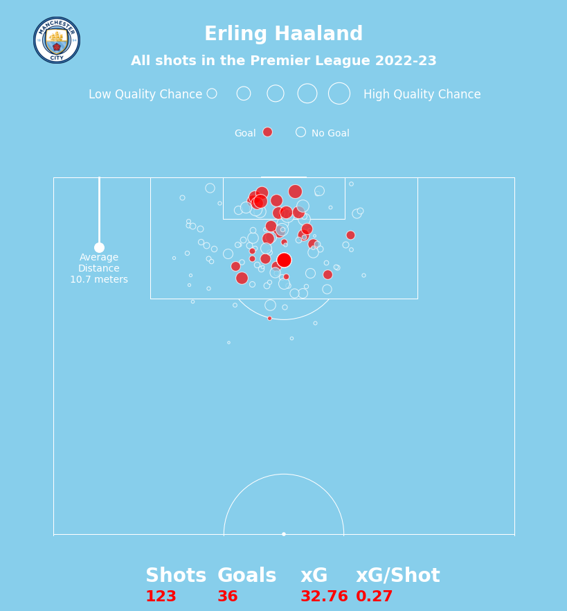
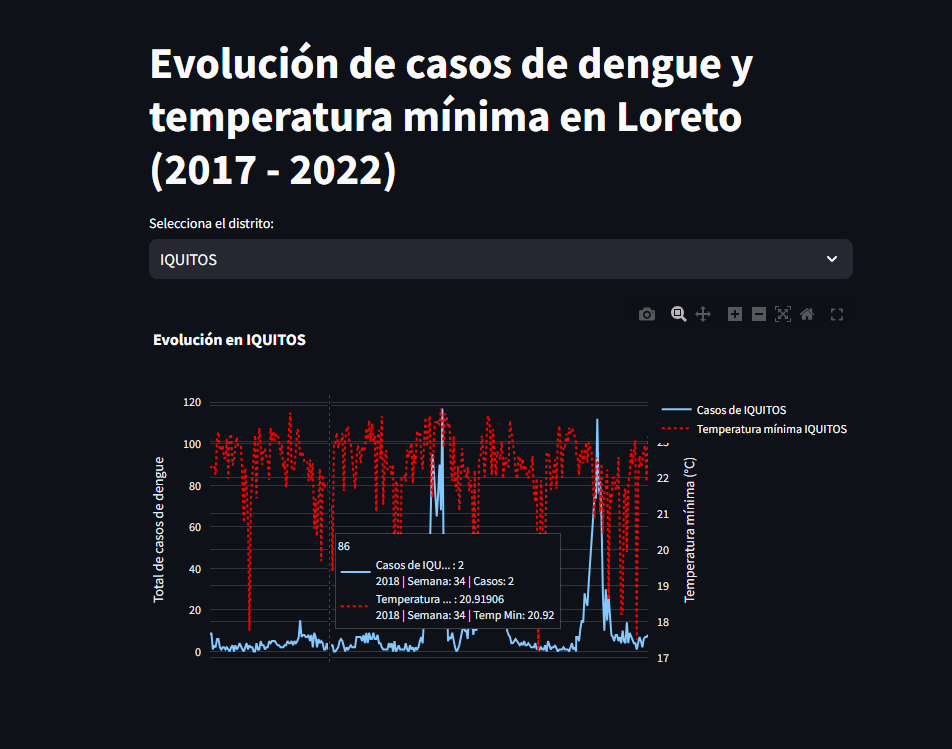

 
Hi! I'm Jose Cebrian, a Biomedical Engineering graduate and Statistics student with a strong focus on clinical engineering, data science, and medical research. Throughout my academic and professional journey, I’ve developed expertise in process optimization, data analysis, and machine learning. In my portfolio, you'll find a collection of projects that showcase my skills in data exploration, Python programming, and Artificial Intelligence. I have experience working as an R&D Coordinator for AI models, where I led deep learning projects and optimized system performance. Additionally, I have a background in data analysis and digital infrastructure, focusing on real-time monitoring. I’ve worked on research projects related to medical imaging and 3D thermal models, while also serving as an instructor for advanced programming. I’m proficient in Python, R, and PostgreSQL, and I'm passionate about using AI to solve real-world healthcare challenges.

# [Project 1: Manchester City Treble Winners Analysis](https://github.com/JoseCebrian12/ManCity2022-2023) 

In this project, I analyzed Manchester City's performance during their historic treble-winning season (Premier League, FA Cup, and Champions League). This analysis covers both team and individual player performance, with a focus on offensive and defensive metrics. Using data from various competitions, I explored key statistics like goals (GF), expected goals (xG), and defensive actions, providing deep insights into how the team and key players like Erling Haaland and Kevin De Bruyne performed. Visualizations were created using Matplotlib, mplsoccer, and integrated player images for an enhanced presentation.

  

# [Project 2: Dengue Incidence Analysis in Loreto](https://github.com/JoseCebrian12/Data-Challenge-Innovalab) 

This project focuses on analyzing the relationship between weekly minimum temperatures and dengue incidence in the districts of Loreto, Peru, from 2017 to 2022. I used statistical models like Poisson regression and Negative Binomial regression to evaluate the impact of climatic variables on dengue cases. The analysis also included residual analysis and tests for overdispersion to justify the use of count models. To facilitate data exploration, an interactive visualization was developed using Streamlit, allowing users to examine the trends of dengue cases and temperature fluctuations across different districts.  

  

# [Project 3: Development and evaluation of an artificial intelligence model for the automation of early diagnosis of liver fluke using automated reading of biomarker tests](https://github.com/JoseCebrian12/Tesis-fasciola)

This project aims to develop an alternative method for the detection of Fasciola hepatica using colorimetry, employing machine learning and computer vision techniques. To achieve this, several tasks will be carried out, including determining the technical requirements and necessary variables for the development of the predictive model of color ranges, designing and implementing an image processing system that allows the removal of background and improves accuracy in the detection of biomarkers, developing the predictive model for the classification of images obtained from biomarkers as positive or negative for the presence of Fasciola hepatica, validating the performance of the predictive model using precision parameters compared to current detection techniques on real patient samples, and finally, creating an interface that allows interaction with the hardware responsible for acquiring images from samples.

  

