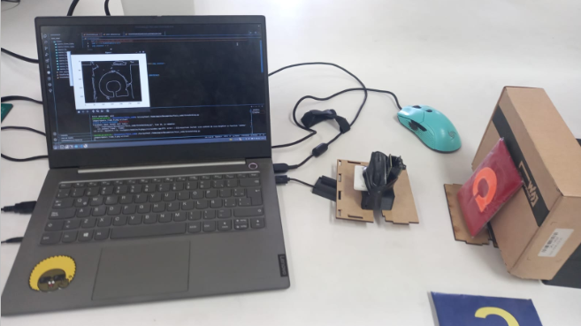

 
Hi! I'm Jose Cebrian, a Biomedical Engineering graduate and Statistics student with a strong focus on clinical engineering, data science, and medical research. Throughout my academic and professional journey, I’ve developed expertise in process optimization, data analysis, and machine learning. In my portfolio, you'll find a collection of projects that showcase my skills in data exploration, Python programming, and Artificial Intelligence. These projects range from **medical image analysis** to the development of **AI-driven APIs** for object classification. I have experience working as an R&D Coordinator for AI models, where I led deep learning projects and optimized system performance. Additionally, I have a background in data analysis and digital infrastructure, focusing on real-time monitoring. I’ve worked on research projects related to medical imaging and 3D thermal models, while also serving as an instructor for advanced programming. I’m proficient in Python, R, and PostgreSQL, and I'm passionate about using AI to solve real-world healthcare challenges.

# [Project 1: Manchester City Treble Winners Analysis](https://github.com/JoseCebrian12/ManCity2022-2023) 

In this project, I analyzed Manchester City's performance during their historic treble-winning season (Premier League, FA Cup, and Champions League). This analysis covers both team and individual player performance, with a focus on offensive and defensive metrics. Using data from various competitions, I explored key statistics like goals (GF), expected goals (xG), and defensive actions, providing deep insights into how the team and key players like Erling Haaland and Kevin De Bruyne performed. Visualizations were created using Matplotlib, mplsoccer, and integrated player images for an enhanced presentation.

# [Project 2: Predictive Modeling for In-Hospital Mortality among ICU-Admitted Heart Failure Patients](https://github.com/JoseCebrian12/icu-admission) 
 

This project aimed to develop and validate a prediction model for all-cause in-hospital mortality among ICU-admitted HF patients using the MIMIC III dataset. The project included an exploratory data analysis, pre-processing steps such as scaling the data and addressing class imbalance with SMOTE, and training an XGBoost model to predict the outcome variable. The final model achieved promising results and could potentially be used to inform clinical decision-making and improve patient outcomes.

# [Project 3: Development and evaluation of an artificial intelligence model for the automation of early diagnosis of liver fluke using automated reading of biomarker tests](https://github.com/JoseCebrian12/Tesis-fasciola)

This project aims to develop an alternative method for the detection of Fasciola hepatica using colorimetry, employing machine learning and computer vision techniques. To achieve this, several tasks will be carried out, including determining the technical requirements and necessary variables for the development of the predictive model of color ranges, designing and implementing an image processing system that allows the removal of background and improves accuracy in the detection of biomarkers, developing the predictive model for the classification of images obtained from biomarkers as positive or negative for the presence of Fasciola hepatica, validating the performance of the predictive model using precision parameters compared to current detection techniques on real patient samples, and finally, creating an interface that allows interaction with the hardware responsible for acquiring images from samples.

  

